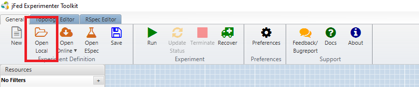
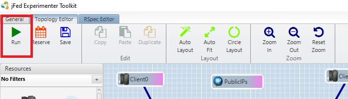
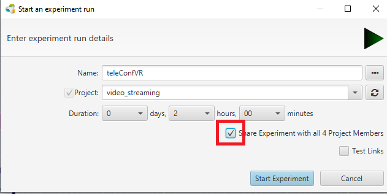
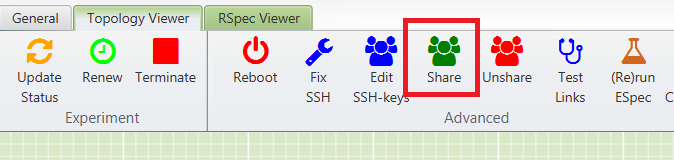
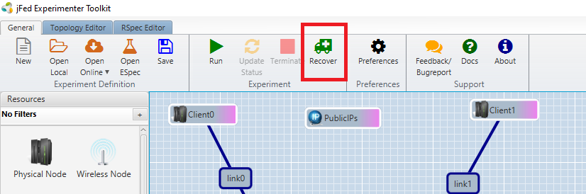
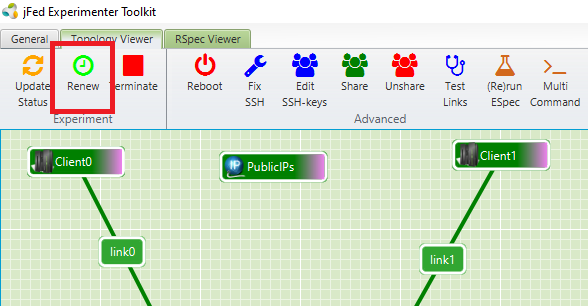
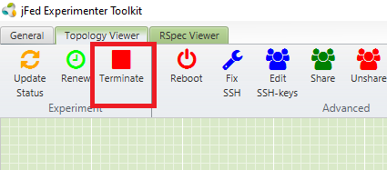

# Many-to-Many
This repository contains the instructions to run the [many-to-many volumetric video streaming](https://github.com/idlab-discover/pc-webrtc-m2m) pipeline on the imec [Virtual Wall](https://doc.ilabt.imec.be/ilabt/virtualwall/) infrastructure.


## Installation

### jFed
To launch an experiment you will first have to download the [jFed toolkit](https://jfed.ilabt.imec.be/downloads/). This tool gives you access to the Virtual Wall testbed, and allows you to create a network of interconnected physical nodes for your experiments, with optional public IP access.

### Fed4Fire Account
In order to gain permission to use the hardware on the virtual wall, you will need to create a [Fed4Fire account](https://portal.fed4fire.eu/). When you create this account, you should use an email that is linked to a known research institution. During creation, you will also be asked to create or join a project. If your team consists of multiple people, only one person has to create a new project, the other members can request to join the existing project. 

## jFed Usage
To create and run experiments, you will need to use the `jFed Experimenter Toolkit`, which you should have installed in the previous step.

### Loading a Rspec File
Instead of making your own setup, you can load a premade Rspec file that contains the structure of an interconnected network of bare metal nodes, with optional setup scripts. 

In the case of this repo, this Rspec file (`autosetup_spirit.rspec`) contains a network of four clients node, all connected to a central server. The Rspec file also executes a variety of setup scripts that create all the necessary routes between nodes and install the necessary software for each different type of node (i.e., client, switch and server).



Once you have loaded the Rspec file press `Run` to start the experiment.



Before the experiment starts you will have to supply a short name for your experiment (max 8 characters). Make sure to check the `Share` option to ensure that your whole project team will have access to the experiment. The next step will explain how to share an experiment with only certain team members. 



### Sharing an Experiment
If you forgot to share the experiment during creation, or only want to share with specific members, you can press the `Share` button at the top.



### Recovering an Experiment
After you have created an experiment, you can always retrieve it during it's lifetime by pressing `Recover` at the top of jFed. 



### Extending the Duration of an Experiment
If you realize that you will need more time to complete your experiments, you can always request an extension of the duration by pressing `Renew` at the top of jFed. In general, each extension will be accepted.



### Stopping an Experiment
Once you have completed your experiments, you should release the used resources by pressing `Terminate`. This will delete all data on your nodes and return them to the pool of available resources, allowing them to be used by other researchers.



### Availability of Nodes
You can only run this experiment if sufficient nodes and public IP addresses are available. The [monitor website](https://fedmon.fed4fire.eu/testbed/vwall2) for the Virtual Wall 2 displays the current number of available resources, as well current login problems.

For this experiment there has to be at least 9 available raw nodes and 5 public IP addresses.

## Usage

Once all nodes have been provisioned and started (nodes are all green), you should do the following: 

Right click `PublicIPs` and click `Show Address Pool Info`. This will display all public IPs that are used by the experiment. In general, you will only need to remember the first one (linked to the central server) as this will allow you to download the necessary OpenVPN files and control the interfaces on the switch nodes.

> :warning: Even though the node in jFed might be green, it is possible that some scripts are still being run. In case a node is not yet available (e.g., pingable), it will be shortly after it turned green.

Once you have the IP of the central server, you will able to either use command line tools (such as curl) or use the provided dashboard to control your experiment.

## Dashboard
If you go to `http://PUBLIC_IP_SERVER:5000/dashboard`, you will be able to access the dashboard. From this window you are able to perform certain actions.

The first part of the dashboard is located at the top right of the window. Here you have the ability to start or stop the SFU server, with the ability to enable/disable GCC-based congestion control. Doing so will prevent the SFU from performing any bandwidth estimation and quality adaptation, and will instead force the SFU to always send all data to every connected user (expect the source of the data). The second checkbox enables/disables the adaptive bitrate algorithm. If this is disabled all content will be forwarded without performing any quality adaptation based on the estimated bitrate and position/fov of each client. 

The second part of the dashboard is the main control panel. This panel is also used to check if the switch and client nodes are fully operational, this is the case when the `Connecting` icon disappears. The first thing you will want to do is to download the `.ovpn` files for each of the clients. With these files you will be able to connect your physical devices to the client nodes on the Virtual Wall.


## Command Line Tools
To automate your experiments you can use any tool that is able to perform network requests. Below you can find an example which uses `curl` to perform the network requests required for the different tasks.

### Downloading OpenVPN Client Files
If you want to connect your physical device to the virtual wall, you will have to use [OpenVPN](https://openvpn.net/client/client-connect-vpn-for-windows/). Each client node has a corresponding .ovpn file you can retrieve by performing the following command: 
```
curl -o client0.ovpn http://PUBLIC_IP_OF_CENTRAL_SERVER:5000/dashboard/openvpn/client0
```

### Retrieving Switch Interfaces
If you want to make changes to the available bandwidth or introduce loss / delay, you will first need to find the interface names of the corresponding client switch.

```
curl http://PUBLIC_IP_OF_CENTRAL_SERVER:5000/dashboard/interfaces?clientid=0
```
This will return the following JSON object:
```
{
  "clientToSwitch": {
    "interface": "enp6s0",
    "ip": "192.168.1.2"
  },
  "switchToServer": {
    "interface": "enp12s0",
    "ip": "192.168.5.3"
  }
}
```
With `clientToSwitch` being the interface located between the client and the switch, and thus will impose restrictions on packets being retrieved by the client. `switchToServer` is the interface located between the switch and the central server, and thus imposes restrictions on outgoing packets from the client.


### Imposing Network Restrictions on Switch Interfaces
Below you can find the all parameters you can supply in the JSON body of the request. Using 0 as the value will result in that parameter being ignored. There is no need to add the unit to the field, this will be added automatically. The interface value should be one of the value you retrieved from the previous step.

| Parameter | Required | Unit       |
|-----------|----------|------------|
| interface | Yes      |          / |
| bandwidth | No       |     Mbit/s |
| latency   | No       |         ms |
| jitter    | No       |         ms |
| loss      | No       | Percentage |

```
curl -X POST -H "Content-Type: application/json" -d '{"interface":"eth0","bandwidth":1000,"latency":10,"jitter":5,"loss":0.5}' http://PUBLIC_IP_OF_CENTRAL_SERVER:5000/dashboard/interface
```

### Starting the SFU
You can start the SFU server with the following request. Bandwidth estimation and quality adaptation are both optional. It is possible to disable bandwidth estimation and still use the quality adaptation. When you do this, the algorithm uses the bandwidth specified (by default 125 Mbit/s) in the SFU dashboard (which you can visit at `http://PUBLIC_IP_OF_CENTRAL_SERVER:8080/dashboard`) 
| Parameter | Required | Description       |
|-----------|----------|------------|
| enableGCC | Yes      |          Enables bandwidth estimation using GCC |
| enableABR | Yes      |          Enables quality adaptation using the bitrate and the user position/fov  |

```
curl -X POST -H "Content-Type: application/json" -d '{"enableGCC":true,"enableABR":true}' http://PUBLIC_IP_OF_CENTRAL_SERVER:5000/dashboard/sfu
```


### Stopping the SFU

```
curl -X POST http://PUBLIC_IP_OF_CENTRAL_SERVER:5000/dashboard/sfustop
```